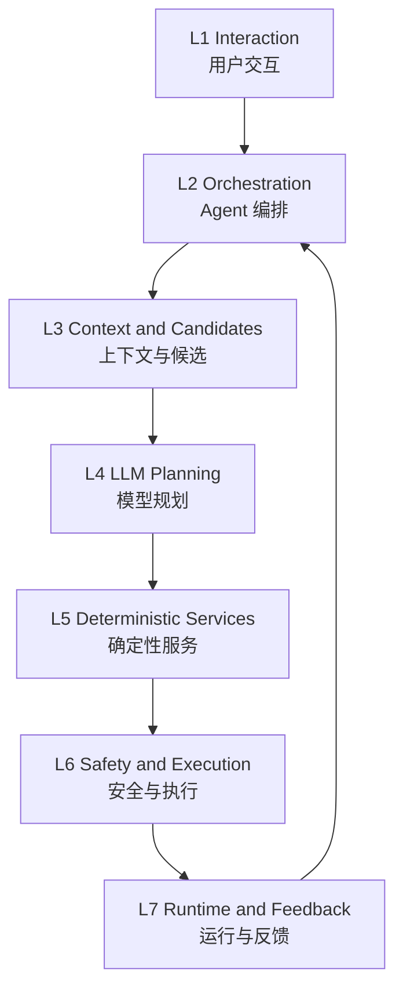

# Complete Agent Reference Architecture｜完整 Agent 参考架构

FLAFA 家庭飞行云台 AI 辅助拍摄 Agent | Architecture Reference｜架构说明 | 2026-08-18

> 完整架构不是当前程序目录图。它定义产品长期需要具备的七层能力，以及语言模型、确定性系统和硬件执行之间不可跨越的权限边界。

## 1. 七层架构

| 层级 | 核心职责 | 代表模块 |
|---|---|---|
| L1 Interaction｜用户交互 | 接收目标，展示追问、方案、状态和用户控制 | Voice/Text Input、Confirmation、User Controls |
| L2 Orchestration｜Agent 编排 | 组织模型与工具调用，维护任务、版本、分支和检查点 | Orchestrator、Task State、Checkpoint Manager |
| L3 Context & Candidates｜上下文与候选 | 检索必要记忆和事实，生成候选 ID，构建 Context Package | Memory、Fact、Context Builder、Viewpoint Planner |
| L4 LLM Planning｜模型规划 | 理解意图并生成高层 ShootingPlan | LLM Planner |
| L5 Deterministic Services｜确定性服务 | 解析 ID、计算位姿与路径、执行结构和业务规则 | Resolver、Path Planner、Schema、Condition Engine |
| L6 Safety & Execution｜安全与执行 | 最终安全裁决、任务编译与硬件交付 | Safety Supervisor、Task Compiler、Hardware Adapter |
| L7 Runtime & Feedback｜运行与反馈 | 监测现实事件，触发刷新、重规划、暂停、回滚或结束 | Runtime Monitor、Feedback Mapper、Memory Writer |

## 2. 核心边界

> LLM Planner 只生成拍摄策略并选择工具返回的候选 ID。真实坐标、路径、速度、避障与飞控命令由确定性服务和硬件执行系统生成。

| 权威域 | 可以决定 | 不可以决定 |
|---|---|---|
| Semantic Planning Authority｜语义规划权威 | 主体、任务模式、构图、候选 ID、备用策略 | 坐标、轨迹、速度和飞控参数 |
| Deterministic System Authority｜确定性系统权威 | ID 解析、空间位姿、路径、可达性、规则与安全结果 | 擅自改变用户目标 |
| Hardware Execution Authority｜硬件执行权威 | 执行已批准 ShootingTask 并回传真实状态 | 接受未校验模型文本作为控制命令 |

## 3. 三类受控视点

| 类型 | 适用场景 | 模型可选择的内容 |
|---|---|---|
| Persistent Anchor｜持久锚点 | 重复使用的家庭空间和常见机位 | anchor_id |
| Temporary Viewpoint｜临时视点 | 新空间或临时构图 | temporary_viewpoint_id |
| Dynamic Relative Viewpoint｜动态相对视点 | 人物移动和持续跟拍 | tracking_profile_id 与策略 |

## 4. 用户控制原则

系统可以自动执行可逆、低风险、已经授权的微调；主要人物、空间、拍摄模式、明显风险或长期记忆写入发生变化时，需要保留用户确认。暂停、取消与结束权始终可用。
