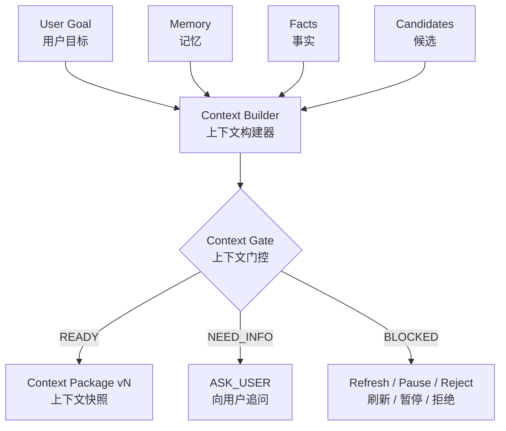

# Context Engineering｜上下文工程与规划执行闭环

从分散信息到可追溯拍摄任务 | Context and Planning Reference｜Context 与规划说明 | 2026-08-18

> Memory 是长期可复用信息，Fact 是当前现实，Context 是某次规划使用的任务快照。FLAFA 不把完整家庭资料直接交给模型，而是为每次任务构建最小、有效、可追溯的 Context Package。

## 1. Context Builder 的位置

## 2. 记忆不是对话记录堆积

家庭拍摄 Agent 的记忆用于理解“这是哪个家庭、在什么空间、拍谁、怎么拍，以及过去哪些选择有效”。设计目标是长期可复用、按任务检索、来源可追溯、冲突可处理并允许用户纠错；临时人物位置、一次性障碍和当前光照不能污染长期记忆。

| 类型 | 主要内容 | 写入方式 | 典型用途 |
|---|---|---|---|
| M1 Family Members & Relations｜家庭人物与关系 | 匿名人物 ID、关系、常见互动组合、授权范围 | 用户确认家庭档案更新 | 多人构图、主体判断与权限过滤 |
| M2 Home Spaces & Anchors｜家庭空间与拍摄锚点 | 房间边界、常态家具、可飞范围、禁飞区、持久锚点 | 首次建档、空间更新或用户确认保存 | 查找可用锚点、候选生成与路径校验 |
| M3 Imaging Preferences｜用户影像偏好 | 画幅、时长、节奏、构图、原声与剪辑倾向 | 明确指令或重复确认后写入 | 生成更符合用户习惯的任务策略 |
| M4 Events & Experience｜拍摄事件与经验 | 历史任务、成功镜头、用户选择与异常原因 | 任务结束后的结构化总结 | 相似家庭事件的经验复用 |
| M5 Reusable Plans｜常用方案 | 用户保存的可复用拍摄参数包 | 用户主动保存或明确确认 | 快速启动常见拍摄任务 |
| M6 Current Task State｜当前任务状态 | 当前主体、视点、计时、检查点与临时事件 | 任务运行时生成，任务结束后清理 | 持续判断、回滚与恢复 |

M1-M5 面向跨任务复用，M6 只服务当前任务。系统不因为一次拍摄成功就自动把临时视点写入长期记忆，而是在任务结束后询问用户是否保存。

## 3. 长期记忆、短期事实与写入边界

| 信息 | 处理方式 |
|---|---|
| 房间边界、常态家具、禁飞区和用户确认的持久锚点 | 可作为长期空间记忆，但更新需保留来源和用户控制 |
| 临时障碍、当前人物位置、光照、门窗和连接状态 | 作为短期事实；每次任务前重新检查，不直接覆盖长期档案 |
| 身份、儿童信息、空间和长期偏好 | 写入需要明确来源、授权范围以及查看、纠正、停用和删除能力 |
| 拍摄事件经验 | 保存结构化摘要，不保留与复用无关的原始音视频 |
| 陌生人偶然入镜 | 使用临时匿名标识，不自动识别、设为主要主体或写入档案 |

删除或纠正记忆后，依赖该信息的常用方案可能需要重新确认。用户本次明确指令与历史偏好冲突时，本次指令优先，但不会自动改写长期偏好。

## 4. Context Builder 如何取用信息

1. 读取当前明确指令和 Task State，识别目标与缺失字段。
2. 按权限检索与任务相关的人物、关系和授权信息。
3. 检索目标空间，以及持久锚点、临时视点和动态跟拍候选。
4. 加载相关影像偏好、历史事件摘要和常用方案。
5. 加入最新设备、环境、人物、路径和风险事实。
6. 执行权限过滤、相关性排序、冲突处理和新鲜度检查。
7. 保留来源、时间、置信度与 TTL，并完成长度裁剪和 Schema 校验。
8. 输出最小、版本化 Context Package；不把完整家庭档案交给模型。

## 5. 优先级、冲突与门控

上下文优先级依次为：P0 安全、权限和硬件红线；P1 当前明确用户指令；P2 实时人物、空间和设备事实；P3 当前确认状态；P4 长期记忆和常用方案；P5 系统默认值。

| 冲突 | 处理原则 |
|---|---|
| 当前指令与历史偏好不一致 | 当前指令优先；不自动修改长期偏好 |
| 实时空间状态与长期档案不一致 | 为安全采用实时事实；任务后询问是否更新空间记忆 |
| 多个相似人物或候选置信度不足 | 追问用户，不猜测主体或视点 |
| 旧方案与新安全规则冲突 | 重新校验；旧方案不能覆盖安全规则 |
| 临时视点在本次任务表现良好 | 询问是否保存，不自动持久化 |

关键字段完整且事实有效时，Context Gate 返回 READY；信息不足时返回 NEED_INFO 并追问；事实过期时返回 REFRESH_REQUIRED；风险可恢复时返回 TEMPORARILY_BLOCKED；无权限或触发安全红线时返回 HARD_BLOCKED。

## 6. 从 ShootingPlan 到 ShootingTask

| 对象 | 产生者 | 内容 | 权限边界 |
|---|---|---|---|
| Context Package vN | Context Builder | 当前任务最小事实、记忆摘要和候选 ID | 不包含完整家庭档案、真实坐标和密钥 |
| ShootingPlan | LLM Planner | 主体、模式、构图、时长、候选 ID、切换和备用策略 | 语义策略，不是控制命令 |
| Resolved Execution Context | 确定性服务 | 解析后的视点、路径引用、规则与设备事实 | 不进入模型编辑范围 |
| ShootingTask | Task Compiler | 已批准计划和确定性引用组成的执行任务 | 通过 Safety 与用户确认后才能生成 |

## 7. 多轮追问

当用户只说“拍摄儿童写作业的画面”时，系统不会虚构房间与时长，而是询问缺失信息。补充回答通过轮次引用连接原始需求，生成新的 Context 版本，再进入规划。

## 8. Memory、Context 与 Checkpoint 的关系

- Memory 保存跨任务可复用且经规则允许的信息。
- Context Package vN 是某一次规划使用的最小任务快照。
- CP0-CP4 Checkpoint 保存一次任务内可恢复的稳定语义状态。
- Runtime 中事实发生变化时，系统刷新 Context 或重规划；回滚只恢复任务语义，不把过期现实事实当作仍然有效。

## 9. 可追溯性与用户控制

每个 Context、Plan、Task 和 Runtime State 都带版本与来源。确认过期计划、重复命令和乱序事件会被拒绝或幂等处理，使一次决策可以追溯到当时使用的事实与用户输入。用户可以查看、纠正、停用或删除长期记忆，并可以拒绝将本次任务结果保存为经验或常用方案。
