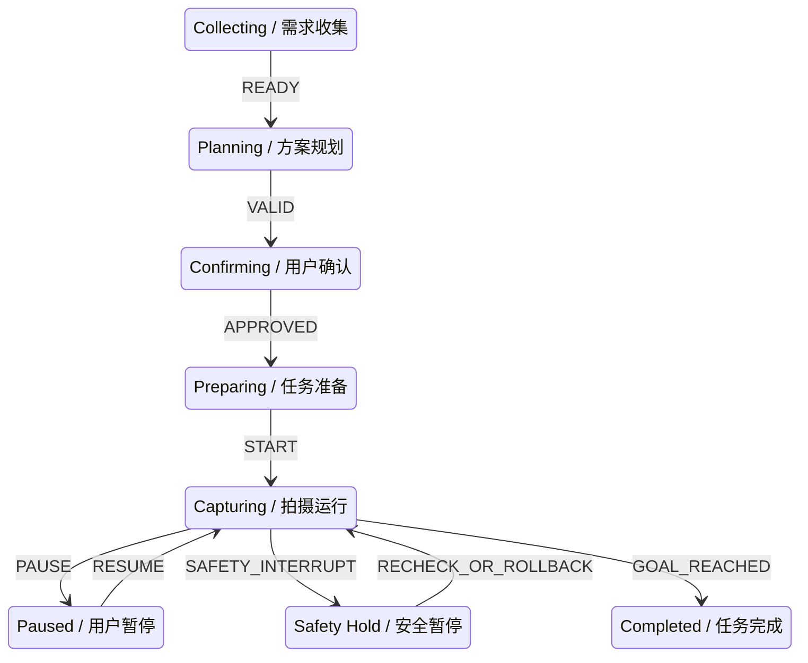

# Safety, Runtime and Data Governance｜安全、运行时与家庭数据治理

FLAFA 家庭飞行云台 AI 辅助拍摄 Agent | Safety and Runtime Reference｜安全与运行时说明 | 2026-08-18

## 1. 安全链

模型输出依次经过 Schema、业务规则与 Condition、Safety Supervisor 三层检查。Safety Supervisor 对电量、路径、温度、禁飞、人员距离、返航余量和设备事实拥有最终否决权；自然语言、模型输出和界面本地状态都不能绕过这条链路。

## 2. 运行时更新

| 变化类型 | 系统行为 | 例子 |
|---|---|---|
| OBSERVE｜观察 | 保持计划，只记录短暂变化 | 短暂入镜或递水 |
| REFRESH｜刷新 | 更新事实和 Context 版本 | 电量、光照、连接或地图版本变化 |
| REPLAN｜重规划 | 目标或构图持续变化时重新规划 | 主体长时间离开或活动改变 |
| SAFETY_INTERRUPT｜安全中断 | 暂停、拒绝、复核或回滚 | 路径阻挡、低电量、不可达或切换失败 |

重大机位切换失败时，系统恢复最近稳定 Checkpoint，而不是在不确定状态下继续执行。

## 3. 家庭数据最小化

- Context 只包含当前任务需要的最小事实和记忆摘要。
- 人物优先使用匿名 ID 与关系标签；陌生人偶然入镜不自动识别或建档。
- 临时视点、一次性光照和人物位置默认不写入长期记忆。
- 事件经验和常用方案只有在用户确认后才能保存。
- 当前任务状态只用于持续判断、回滚与恢复，任务结束后清理。
- 用户可以查看、纠正、停用或删除长期记忆；删除后相关方案可能需要重新确认。
- 密钥只由后端读取，不出现在浏览器、文档、健康检查和公开截图中。

## 4. 用户与 Safety 的关系

用户可以暂停、取消和结束任务，也可以拒绝长期保存；但用户或模型不能取消强制安全规则。事实过期必须刷新，风险可恢复时暂停复核，安全红线时拒绝执行。

## 5. 结论边界

当前版本确认了软件层的数据最小化、安全门控和用户控制原则。供应商地域与训练使用、长期保留期限、账号隔离、设备端加密和硬件安全事件响应，需要在真实服务与硬件接入阶段继续量化。
