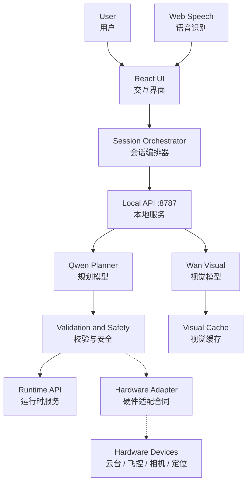

# v8.4.0 Software Implementation｜当前软件能力与模型接入

FLAFA v8.4.0 | Software Implementation Reference｜软件实现说明 | 2026-08-18

> 当前软件实现是完整 Agent 参考架构的阶段性落地。软件实现拓扑不等同于完整 Agent 架构，软件验证结果也不等同于真实硬件认证。

## 1. 当前实现拓扑

## 2. 已开发的软件能力

| 能力 | 当前实现 |
|---|---|
| Interaction｜交互 | React + TypeScript 界面，语音/文字输入、确认、追问、方案、拍摄状态和完成流程 |
| ASR｜语音识别 | Browser Web Speech API 中文连续识别、静默确认、错误提示和键盘回退 |
| Orchestration｜会话编排 | SessionOrchestrator 维护轮次、确认、幂等、计划版本和状态衔接 |
| Memory and Context｜记忆与上下文 | M1-M6 记忆合同、Context Builder、任务状态与版本化 Context Package；生产级家庭长期存储与账号隔离仍属于后续服务接入 |
| Planning｜规划 | Qwen qwen3.7-max 生成语义 ShootingPlan |
| Validation & Safety｜校验与安全 | Schema、Normalizer、Condition、Safety 与 Task Compiler |
| Runtime｜运行时 | 状态、命令、事件、计时、暂停、恢复、完成和 CP4 回滚 |
| Visual｜视觉表达 | Wan wan2.7-image 生成方案预览/拍摄表达，并使用本地缓存与显式回退 |
| Operations｜运行保障 | Demo Guard 完成环境自检、一键启停、健康检查与项目外日志 |

## 3. 模型与确定性模块如何协作

- Qwen 负责理解用户意图和组织高层拍摄策略。
- Wan 负责可视化方案意图，不改变方案的安全与可执行结论。
- Web Speech 是输入适配器，识别失败时可以切换键盘，不改变 Agent 权限链。
- 真实视点、路径、业务规则和安全结论由确定性模块产生。

## 4. 运行模式

| 模式 | 作用 |
|---|---|
| simulation | 使用确定性 Planner，支持无模型费用的合同与回归开发 |
| hybrid | 真实模型优先，失败时使用显式确定性回退，适合展示与可用性保障 |
| live | 真实模型且禁止回退，用于真实模型专项评测和故障定位 |

## 5. 与硬件的关系

当前软件已经锁定 Hardware Adapter 和 Hardware Event 的边界；真实云台、飞控、相机、定位、地图、路径与避障服务正在研发接入。硬件接入会替换模拟事实和执行适配器，但不会让模型获得物理控制权。
